# NATVPN

## Configuració d'IPS

- IPFire: 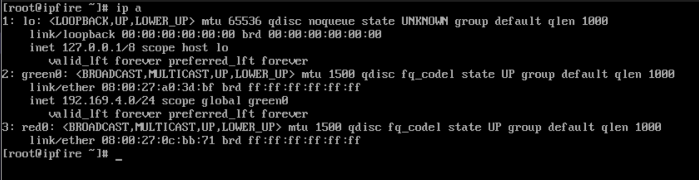
- Zorin: 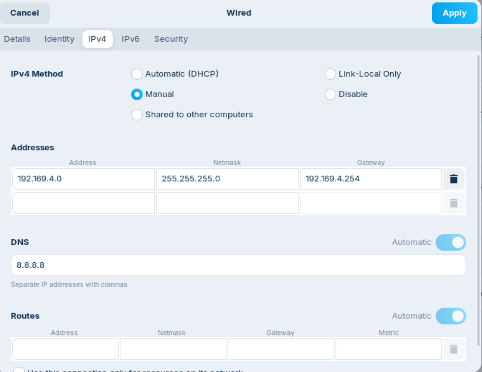
- Client: Està en DHCP. 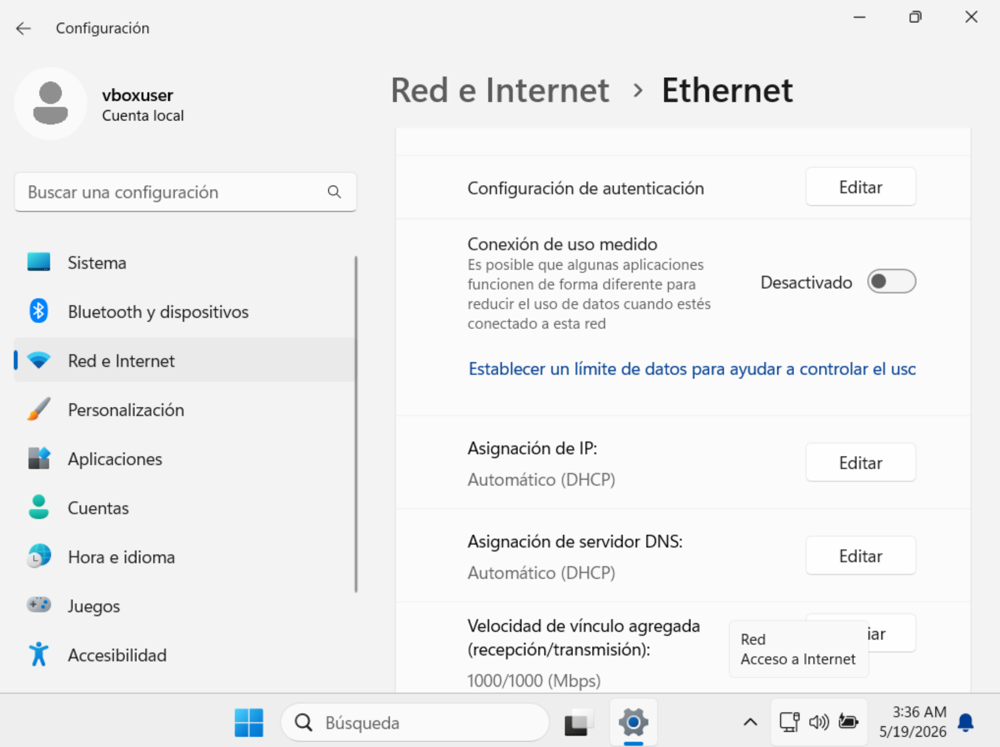

## Serveis

Instal·lem els serveis apache2 i ssh si no els tenim instal·lats.

```bash
sudo apt install apache2
sudo apt install ssh
```

Editem la pàgina d'apache per possar el nostre nom.

```bash
sudo nano /var/www/html/index.html
```

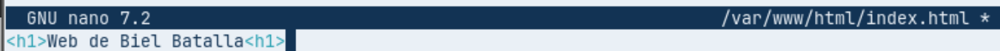

Si introduim la nostra ip al buscador veurem com entrem a la web i es veu la pàgina.

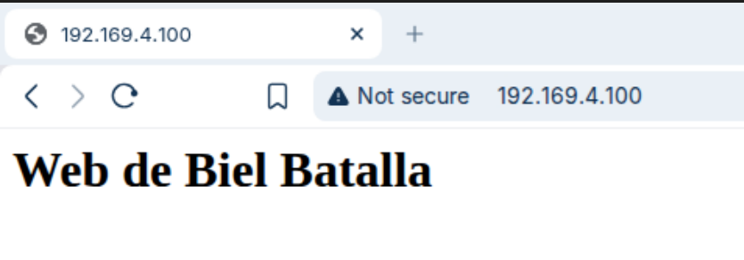

## DNAT Regla SSH

Introduïm una nova regla. En aquest cas, utilitzem el port 2222.

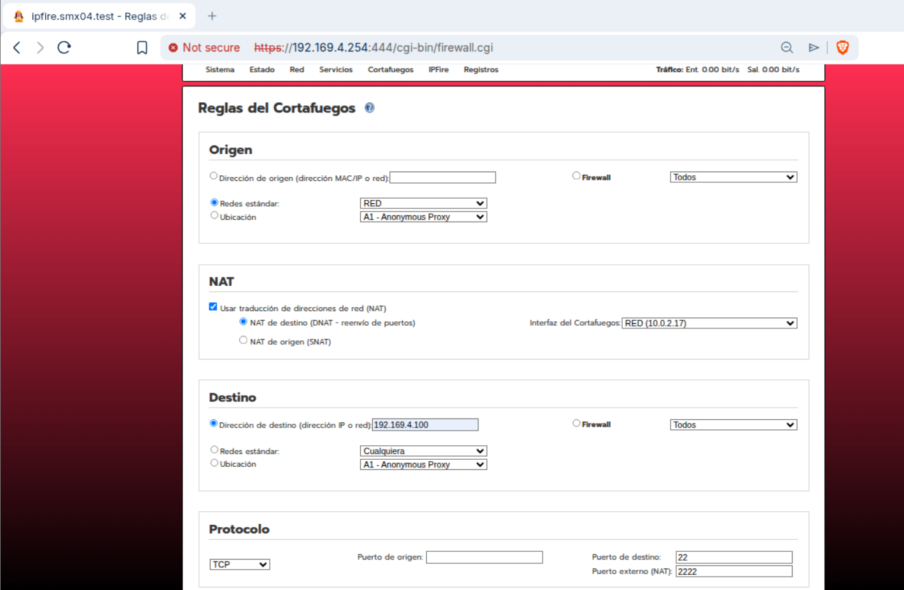
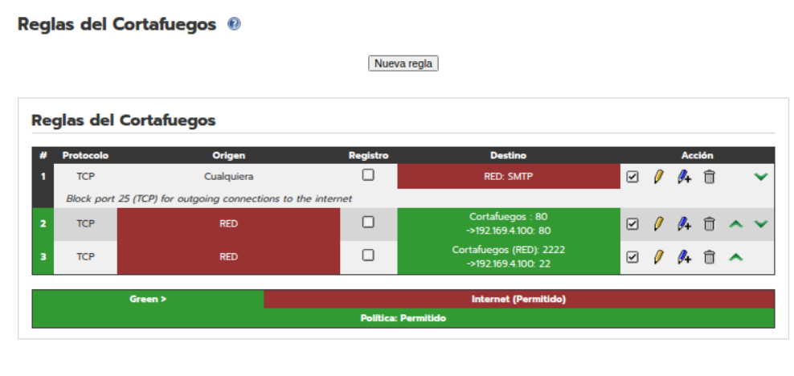

### Comprovació SSH

Des d'un PC extern fem la seguent comanda:

```bash
ssh -p 2222 biel@10.0.2.17
```

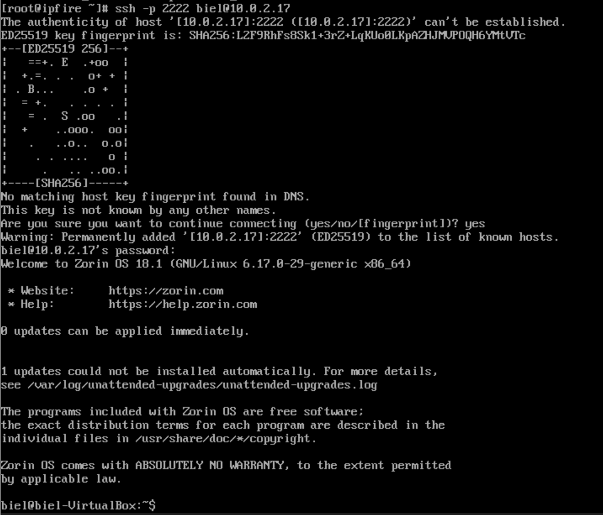

## DNAT Regla HTTP

Entrem a IPFire i anem a cortafocs -> regles -> nova regla. Especifiquem d'orígen RED i activem NAT de destino. Com a destí, introduïm la IP del servidor (192.169.4.100)

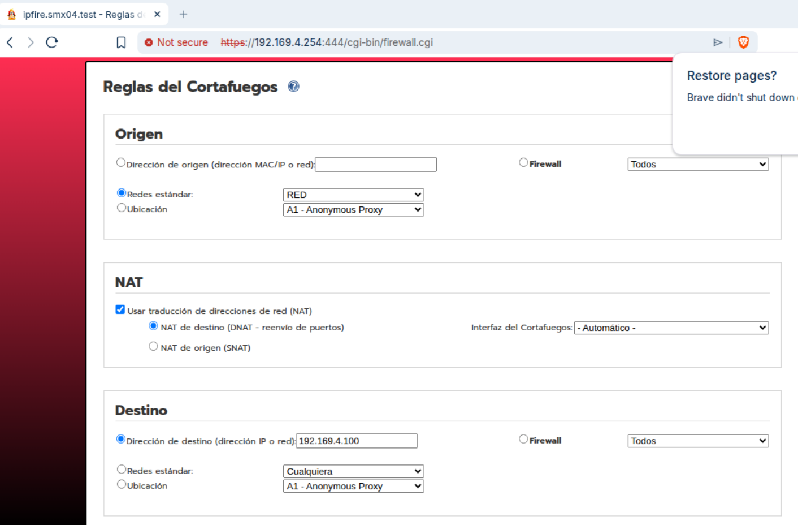

Seleccionem:
- Protocol TCP
- Port 80
- Port extern NAT 80.

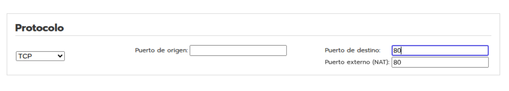

I ja tenim la regla creada.

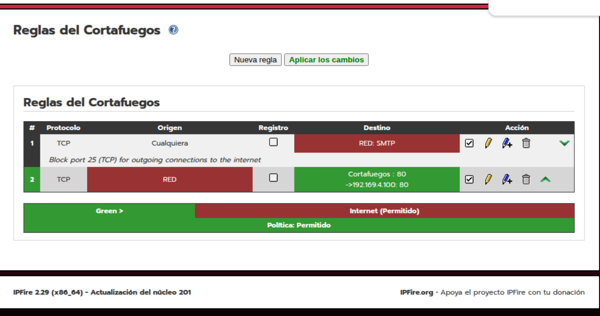

### Comprovació HTTP

Comprovem que funciona amb la màquina client, introduïnt la IP RED.

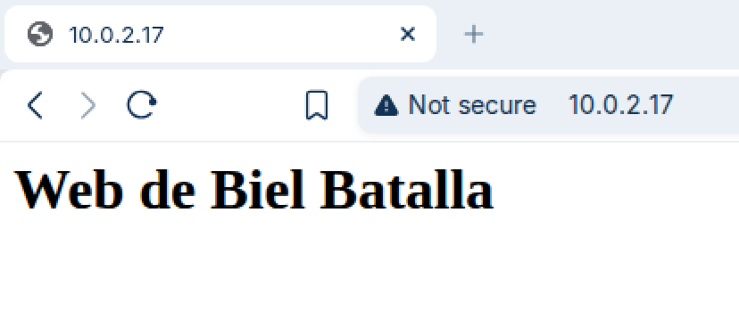

## Configuració VPN

Per fer tots els certificats necessaris, anem a servicios -> openvpn -> generar certificados root/host.

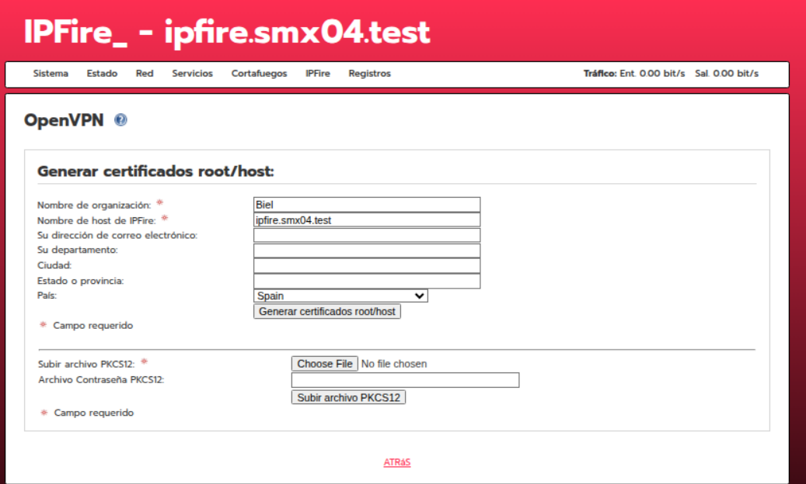

Generem els certificats i ens mostrarà el de root, host i clau tls.

## Configuració VPN Certificats

Anem a tipus de connexió i deixem marcada la predeterminada. Després cliquem agregar.

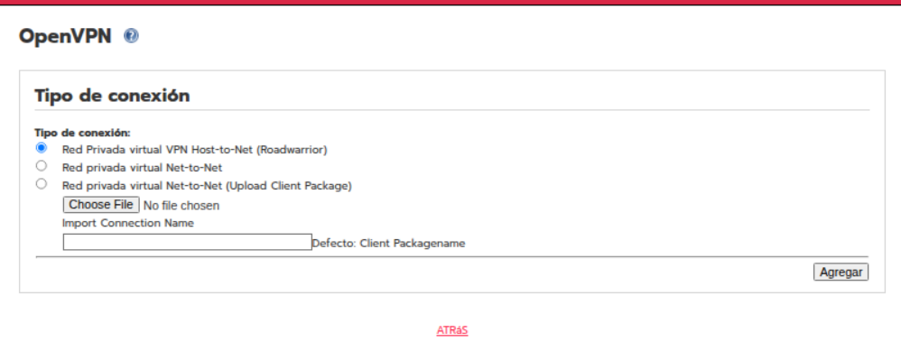

A l'autenticació, introduim el nostre nom, país i contrasenya.

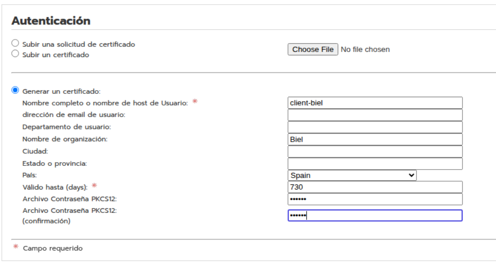

A les opcions avançades donem a Green i possem el DNS del servidor. 

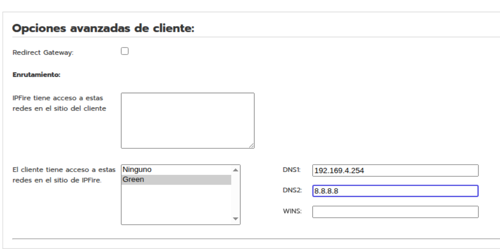

Podem comprovar que ja s'ha creat.

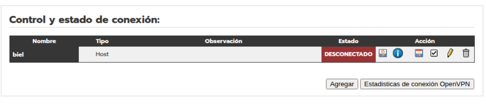

Podem descargar el certificat.

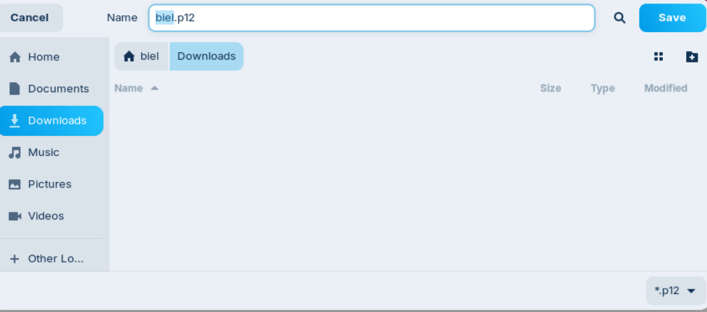

## Configuració VPN Client (Windows)

Per editar l'arxiu de hosts de Windows, haurem d'anar a la seguent ruta:

```bash
C:\Windows\\System32\drivers\etc\hosts
```

Després, afegim una entrada amb el nostre domini. Ha de ser amb permisos d'administrador.

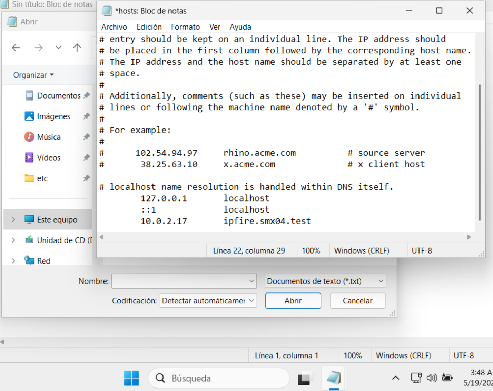

Instal·lem l'OpenVPN.

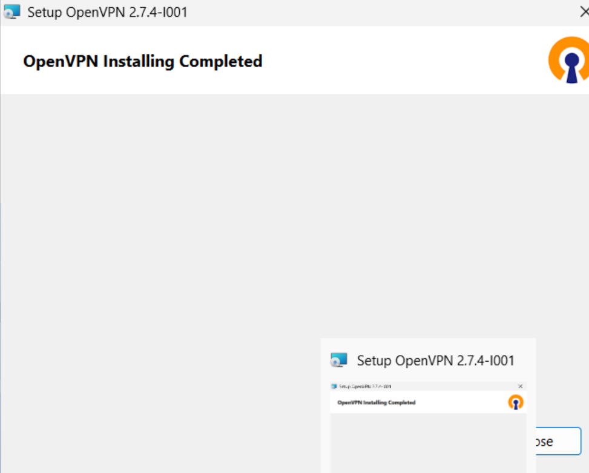

Fem servir scp amb el port 2222.

```bash
scp -P 2222 biel@10.0.2.17:/home/zorin/Downloads/biel.p12
"C:\Users\vboxuser\Downloads"
```

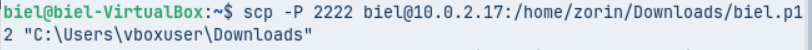

Quan entrem ens demana contrasenya del certificat que haurem especifitcat anteriorment.

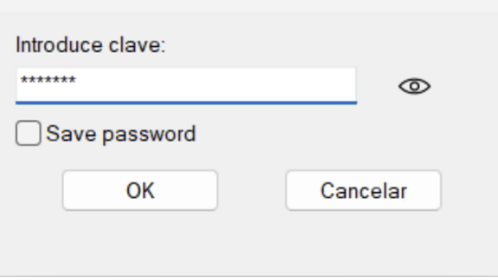

Ara si anem a l'IPFire ja ens sortirà la connexió en CONECTADO.


## Comprovació de funcionament

Accedirem a la web amb l'IP privada. Farem ús de la VPN connectada. 

```bash
http://192.169.4.100
```


